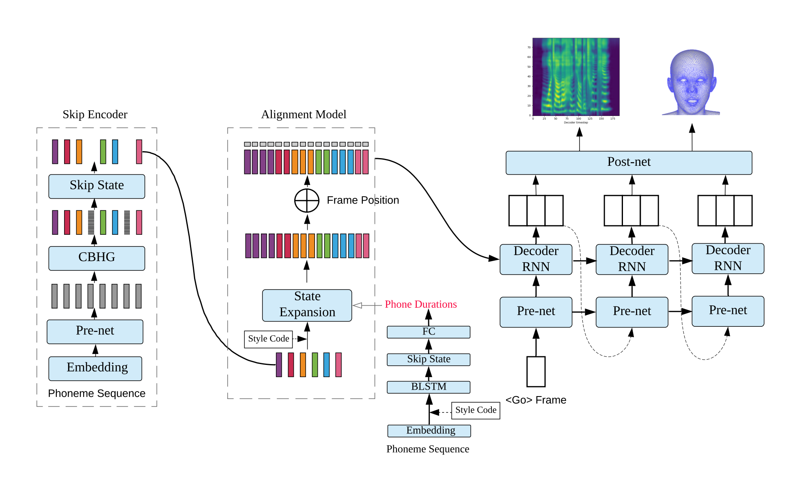

# DurIAN
Implementation of [DurIAN: Duration Informed Attention Network For Multimodal Synthesis](https://arxiv.org/abs/1909.01700)

## Blog
[论文笔记：腾讯AI lab多模态语音合成模型DurIAN](https://zhuanlan.zhihu.com/p/105796626)

## Structure
English:
1. I use the same encoder as tacotron2
2. I remove attention module in decoder and use average pooling to implement "predicting r frames at once"
3. I remove position encoding and skip encoder in this implementation

Chinese:
1. 我用了和tacotron2相同的encoder结构，但是参数更小
2. 我去除了decoder中的attention模块，由于一步输出三帧，我对三个时间步的memory进行了相加求均值的操作，表现在代码中为average pooling，经过实验，相比与存在attention模块的decoder，这样的音质会受到很小的负面影响，但是训练速度有了极大的提高
3. 我舍弃了position encoding和skip encoder，这对合成效果的影响很小

## Sample & Pretrained model
[sample here](https://github.com/xcmyz/DurIAN/tree/master/sample), I use waveglow as vocoder, [pretrained model here](), batchsize is 32, step is 180k.

## Usage
training:
1. `pip install -r requirements.txt`
2. download and extract [LJSpeech dataset](https://keithito.com/LJ-Speech-Dataset/)
3. put LJSpeech dataset in `data`
4. `unzip alignments.zip`
5. `python3 preprocess.py`
6. `CUDA_VISIBLE_DEVICES=0 python3 train.py`

testing:
1. Put [Nvidia pretrained waveglow model](https://drive.google.com/file/d/1WsibBTsuRg_SF2Z6L6NFRTT-NjEy1oTx/view?usp=sharing) in the `waveglow/pretrained_model`
2. `CUDA_VISIBLE_DEVICES=0 python3 test.py --step [step-of-checkpoint]`

testing using pretrained model:
1. put [pretrained model]() in `model_new`
2. `CUDA_VISIBLE_DEVICES=0 python3 test.py --step 180000`

## Notes
尽管DurIAN的生成速度比不上FastSpeech，但是DurIAN生成的样本音质好于FastSpeech，并且计算量也小于FastSpeech，在实际部署中，DurIAN的生成速度已经完全满足RTF要求。